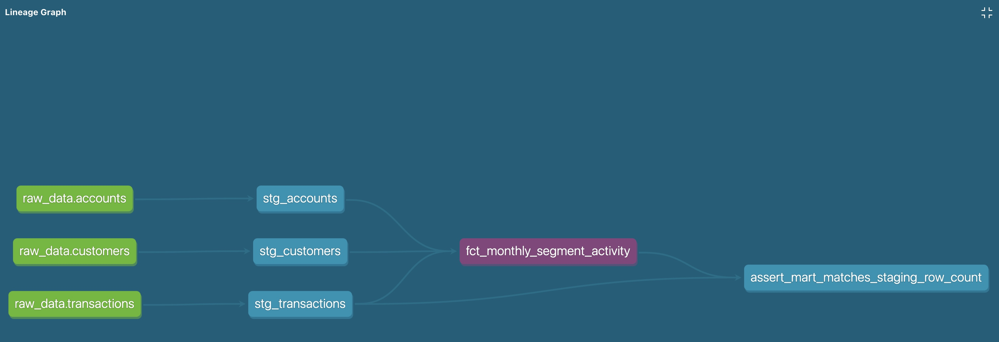

# Neobank Data Pipeline

An end-to-end ELT pipeline built on AWS using **synthetic** neobank data (customers, accounts, transactions).

> All data in this repository is randomly generated. It contains no real customer data and is not derived from any employer's systems.

## Architecture

```
Raw CSV files
   -> Amazon S3 (data lake)
   -> Amazon Redshift Serverless (warehouse)
   -> dbt (transformations)
```

| Layer | Tool | Purpose |
|---|---|---|
| Landing zone | Amazon S3 | Stores raw CSV files |
| Warehouse | Amazon Redshift Serverless | Holds raw tables loaded with `COPY` |
| Transformation | dbt Core | Staging -> intermediate -> mart models, with data-quality tests |

## Dataset

Generated with `generate_data.py` (fixed random seed, so output is reproducible):

- `customers` — 500 rows
- `accounts` — ~760 rows, each linked to a customer
- `transactions` — ~33,000 rows, each linked to an account, spanning 12 months

## Project status

- [x] Synthetic data generator
- [x] S3 bucket and raw file upload
- [x] Redshift Serverless setup
- [x] Raw tables loaded with `COPY`
- [x] dbt project: staging models
- [x] dbt project: mart model (monthly transaction summary per customer segment)
- [x] dbt tests (unique, not_null, relationships)
- [x] Architecture diagram and sample output

## How to reproduce

_To be completed as the project progresses._

### 1. Generate the data

```bash
python3 -m venv venv
source venv/bin/activate
pip install faker
python generate_data.py
```

This creates three CSV files in a local `data/` folder.

## What I learned

_To be completed at the end of the project._

## Design notes

- **Regions:** the S3 data lake is in `eu-central-1` and Redshift Serverless is in `us-east-1`. `COPY` uses the `REGION` option to load across regions. With real EU customer data I would keep both in one EU region for data residency and to avoid cross-region transfer costs.
- **Schema name:** the raw schema is called `raw_data` because `raw` is a reserved word in Redshift.
- **Currencies:** transactions are in EUR, USD and GBP, so aggregates group by currency instead of summing amounts across currencies.

## Running the dbt project

```bash
pip install "dbt-core~=1.12.0" dbt-redshift
export REDSHIFT_PASSWORD='<your-password>'   # never commit this
cd neobank_dbt
dbt debug   # check the connection
dbt build   # run models and tests
```

The connection profile lives in `~/.dbt/profiles.yml` (outside the repo), with host, user and `password: "{{ env_var('REDSHIFT_PASSWORD') }}"`.

**Layers**

| Layer | Schema | Materialization | Models |
|---|---|---|---|
| Staging | `analytics_staging` | view | `stg_customers`, `stg_accounts`, `stg_transactions` |
| Marts | `analytics_marts` | table | `fct_monthly_segment_activity` |

**Tests:** `unique` and `not_null` on every ID, `accepted_values` on segment and direction, `relationships` between transactions, accounts and customers, and a singular test that reconciles mart row counts against staging.

## Sample output

`analytics_marts.fct_monthly_segment_activity` (first rows):

| activity_month | segment | currency | transaction_count | active_customers | total_credits | total_debits |
|---|---|---|---|---|---|---|
| 2025-10-01 | business | EUR | 93 | 15 | 47520.87 | -13716.01 |
| 2025-10-01 | premium | EUR | 139 | 29 | 78099.19 | -18966.73 |
| 2025-10-01 | retail | EUR | 420 | 87 | 194443.67 | -60797.39 |
| 2025-10-01 | retail | USD | 66 | 16 | 31883.49 | -8948.97 |

Amounts are grouped by currency on purpose; summing EUR, USD and GBP together would be meaningless.

## Lineage


